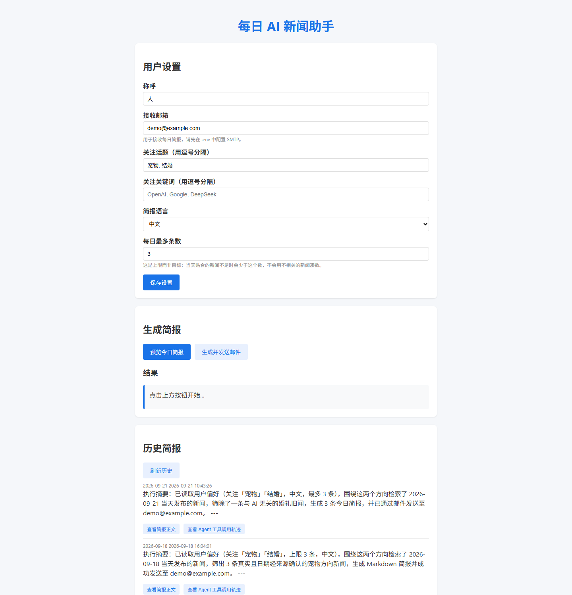

# 每日 AI 新闻助手 Agent

一个**由大模型自主决定工具调用顺序**的每日新闻助手：按用户订阅的话题/关键词检索 AI 新闻，生成 Markdown 简报，通过邮件定时推送，并提供 Web 界面管理偏好与查看历史。

> 核心设计：**没有一个字的代码在编排流程**。所有工具调用的顺序、次数、停止时机都由 LLM 在 ReAct 循环中自行决定，后端只负责执行与落库。
>
> 交付验收记录（依赖清单审计、零配置路径实测、定时链路端到端验证、已在什么范围内可用）见 **[DELIVERY.md](DELIVERY.md)**。



---

## 一、5 分钟跑起来

### 0. 前置条件

- Python 3.10+（推荐 3.11）
- 一个 DeepSeek API Key（可选部分功能：Tavily Key、SMTP 邮箱授权码）
- MySQL 5.7+/8.0（**可选**，不想装数据库时用内置的 SQLite 即可）

### 1. 安装依赖

```bash
python -m venv .venv

# Windows PowerShell
.venv\Scripts\activate
# macOS / Linux
source .venv/bin/activate

pip install -r requirements.txt
```

### 2. 配置环境变量

```bash
cp .env.example .env
```

然后编辑 `.env`，**最少只需要填一个 key**：

```ini
DEEPSEEK_API_KEY=sk-xxxxxxxxxxxx
```

其余配置的作用：

| 变量 | 作用 | 不填会怎样 |
| --- | --- | --- |
| `DEEPSEEK_API_KEY` | 大模型调用（必需） | 无法运行 |
| `TAVILY_API_KEY` | Tavily 网页搜索（推荐） | 自动降级到 RSS 源 |
| `BING_SEARCH_KEY` | Bing 新闻搜索（可选） | 跳过 |
| `SMTP_SERVER` / `SMTP_PORT` / `SMTP_USERNAME` / `SMTP_PASSWORD` | 邮件推送 | Agent 会把简报直接返回而不发邮件 |
| `DEFAULT_RECIPIENT` | 默认收件人 | 前端「设置」里没填邮箱时由它兜底；两边都空才发不出邮件 |
| `SCHEDULE_TIME` / `TIMEZONE` | 每天几点推送，默认 `08:00` `Asia/Shanghai` | 用默认值 |
| `ENABLE_SCHEDULER` | 是否在 Web 进程内跑定时任务，默认 `true` | 用默认值；多 worker 部署时设 `false` |
| `DB_TYPE` 等 | 数据库配置，默认 `sqlite` | 用 SQLite 兜底 |
| `NEWS_MAX_AGE_DAYS` | **时效窗口**：只推送最近 N 天内发布的新闻，默认 `1`（只看今天） | 用默认值。设为 `2` 表示今天+昨天，`7` 表示近一周，`0` 表示不做时间过滤 |
| `NEWS_STRICT_DATE` | 发布时间无法确认的条目如何处理，默认 `false` | 默认保留并标注「发布时间未确认」；设 `true` 则一律丢弃，只保留能确认发布时间的新闻 |
| `RSS_SOURCES` | **追加自定义 RSS 源**，格式 `名称\|地址`，多个用英文逗号分隔 | 留空 = 只用内置的 4 个 AI 源。可用示例见 `.env.example`（均已实测可用） |
| `RSS_INCLUDE_DEFAULTS` | 是否保留内置的 4 个 AI 源，默认 `true` | 设 `false` 则只用 `RSS_SOURCES` 里配的源（例如整体换成别的方向） |
| `RSS_FILTER_BY_QUERY` | 是否要求 RSS 条目先命中查询词才进候选池，默认 `false` | 默认不过滤；打开能挡掉无关条目，但 AI 话题下会误伤约一半「意思相关却没写全关键词」的新闻，只在关注方向明显远离 AI 时才建议开 |
| `MIN_TERM_LEN` | 参与「关键词命中」判定的最短词长，默认 `2` | 单字关键词（如「男」「女」）不参与判定，避免噪声条目拿到虚高的分 |
| `LLM_MAX_RETRIES` / `LLM_TIMEOUT` / `LLM_RETRY_BACKOFF` | 模型调用重试与超时 | 默认重试 2 次、超时 60s、退避 1.5s |
| `API_KEY` | **可选接口鉴权**：填了值之后，所有 `/api` 接口都要求请求头 `X-API-Key` 与之匹配 | 留空 = 不鉴权，本机演示零配置即可用 |
| `CORS_ORIGINS` | 允许跨域访问的来源，逗号分隔 | 默认只允许本机 `http://127.0.0.1:8000` 与 `http://localhost:8000` |

> 密钥**只**通过环境变量读取（全部经 `os.getenv`），代码中不含任何硬编码密钥，`.env` 已被 `.gitignore` 排除。

### 3. 初始化数据库

**方式 A：SQLite（零配置，最快）**

```bash
python migrate.py
```

**方式 B：MySQL（推荐用于演示/生产）**

```bash
# Windows PowerShell
$env:DB_TYPE="mysql"; $env:MYSQL_USER="root"; $env:MYSQL_PASSWORD="你的密码"
python migrate.py

# macOS / Linux
export DB_TYPE=mysql MYSQL_USER=root MYSQL_PASSWORD=你的密码
python migrate.py
```

也可以直接执行建表脚本（脚本只含建表 DDL，不含 `CREATE DATABASE`/`USE`，
库名由 `MYSQL_DATABASE` 决定，所以手动执行时要先自己建库并选中）：

```bash
mysql -u root -p -e "CREATE DATABASE IF NOT EXISTS ai_news_agent DEFAULT CHARACTER SET utf8mb4 COLLATE utf8mb4_unicode_ci"
mysql -u root -p ai_news_agent < db/schema_mysql.sql
```

首次运行时会把旧的 `data/*.json` 数据一并迁移进库：

```bash
python migrate.py --from-json
```

自检（连不通、表缺失会给出提示）：

```bash
python migrate.py --check
```

### 4. 启动服务

激活过虚拟环境后：

```bash
python app.py
# 或 uvicorn app:app --host 127.0.0.1 --port 8000 --reload
```

**如果没有激活虚拟环境，请务必写完整的解释器路径**。裸 `python` 可能指向系统里另一个环境，
那里没装 `pymysql` 等依赖 —— 症状是启动日志里出现「数据库初始化失败」，但服务仍然"启动成功"，
直到每个碰数据库的接口才开始失败：

```bash
# Windows PowerShell（在项目根目录下）
.\.venv\Scripts\python.exe -m uvicorn app:app --host 127.0.0.1 --port 8000

# macOS / Linux
./.venv/bin/python -m uvicorn app:app --host 127.0.0.1 --port 8000
```

浏览器打开 <http://127.0.0.1:8000> 即可看到界面。

### 5. 体验一次完整流程

前端依次点击：

1. **用户设置** → 填写称呼、邮箱、关注话题、关键词 → 保存设置
2. **生成简报** → 预览今日简报（快速，不走 Agent）
3. **生成简报** → 生成并发送邮件（后台执行，轮询结果）
4. **历史简报** → 刷新历史 → 点某条记录的「**查看简报正文**」看完整 Markdown
5. **历史简报** → 点「**查看 Agent 工具调用轨迹**」看这次模型实际选了哪些工具、什么顺序

### 6. 跑测试

```bash
pip install -r requirements-dev.txt   # 测试依赖（pytest、httpx）
pytest                                # 全量测试
```

测试是**完全离线**的：网络请求与模型调用全部打桩，不需要 API Key、不消耗额度、不会真发邮件；
数据库强制切到临时目录下的 SQLite，既不碰本机 MySQL，也不污染仓库里的 `data/`。

覆盖范围见 `tests/`：时效过滤与日期换算、`max_results` 上限语义、简报语言设置、
收件人兜底、shell 白名单与路径沙箱、接口鉴权与数据库故障呈现。

---

## 二、它是怎么工作的

### ReAct 循环：顺序由模型决定

```
 ┌──────────────────────────────────────────────────┐
 │  任务：为当前用户生成并推送今日 AI 简报             │
 └───────────────────────┬──────────────────────────┘
                         ▼
                  LLM 决定：下一步调什么？
                         ▼
        ┌────────────────┴────────────────┐
        │  返回 tool_calls                │  返回 content（不调工具）
        ▼                                 ▼
   执行工具并把结果塞回 messages       ──► 结束，返回最终答案
        │
        └──► 回到循环（最多 10 轮）
```

关键实现在 `agent.py` 的 `run_agent()`：手写 ReAct 循环 + OpenAI 格式 function calling（`llm.py` 对接 DeepSeek 兼容接口）。**没有任何 `if step == 1: search_news()` 这样的硬编码分支** —— 系统提示词只描述"目标 + 可用工具 + 交付格式"，模型自己判断要不要先读偏好、搜几次、要不要发邮件、什么时候停。

想验证这一点，打开前端任意一条历史记录的「查看 Agent 工具调用轨迹」，或者直接调用：

```bash
GET /api/trace/{trace_id}
```

返回的就是本次运行里模型实际选择的工具链，例如：

```
load_preferences → search_news → generate_digest → send_email
```

每一次运行都可能不一样 —— 这正是「① 工具调用顺序由 LLM 决定」的直接证据。

### 工具集（9 个，需求要求的 5 个全部包含）

| 工具 | 说明 |
| --- | --- |
| `list_dir(path)` | 列出项目目录内容 |
| `read_file(path)` | 读取项目内文件（**拒绝 .env 等敏感文件**） |
| `search_content(keyword, dir)` | 目录内关键词全文搜索（自动跳过敏感文件） |
| `write_file(path, content)` | 写入文件，目录自动创建 |
| `bash(command)` | 受限 shell：白名单 + 危险 token 边界匹配 + 禁管道/重定向 + 限定工作目录 + 拒绝引用敏感文件；**白名单不含任何解释器**（`python` / `pip` / `uvicorn` / `pytest` 均不在列） |
| `load_preferences()` | 读取用户订阅偏好（数据库） |
| `search_news(query, max_results)` | 检索新闻（多源合并 + 时效窗口过滤 + 相关性筛选），`max_results` 为**上限**；降级链：Tavily → Bing → RSS → 兜底数据 |
| `generate_digest(news, preferences)` | 生成 Markdown 简报 |
| `send_email(subject, content, to_email)` | SMTP 推送（465 SSL / 587 STARTTLS）；**只允许发往偏好里保存的收件人**，其余地址拒绝 |

### 新闻从哪来

`search_tools.py` 合并多个真实来源后统一收口，保证任何环境下都有结果可给：

1. **Tavily API** —— 使用 **`topic="news"`**（不是 `general`）。这点很关键：`general` 主题**不返回发布日期**，
   结果里混着年鉴、月报、百科等旧内容；`news` 主题才提供 `published_date`，
   并能用 `days` 参数从源头限定回溯天数；同时保留域名黑名单（YouTube/B站/抖音等视频平台）
2. **Bing News Search API** —— Tavily 未配置或失败时回退，用 `freshness` 限定时间范围、`sortBy=Date` 按发布时间倒序
3. **RSS** —— 量子位 / InfoQ / 雷峰网 / 钛媒体 四个中文 AI / 科技媒体源（带 10 秒超时，源站不响应不会挂死）；可用 `.env` 的 `RSS_SOURCES` 追加更多来源
4. **兜底示例数据** —— 全部源都不可用时才返回占位数据，**每条都带 `is_mock=true` 与显著提示**，
   简报开头由代码强制加"本次未获取到真实新闻"的声明，不会被当成当天真实新闻推送

#### 时效是硬约束，不靠模型自觉

「每日简报」只允许用**当天发布**的新闻 —— 这一条由代码保证，而不是写在提示词里指望模型遵守：

- **取真实日期**：Tavily 读 `published_date`、Bing 读 `datePublished`、RSS 读 `published_parsed`。
  **任何来源拿不到日期时不再用当前时间顶替**（旧版本正是这么做的，后果是把几个月前的回顾文章标成"今天"），
  而是留空并标记 `date_verified=false`
- **按本地时区换算**：窗口边界按 `TIMEZONE`（默认 `Asia/Shanghai`）计算。
  RSS 的 `published_parsed` 是 UTC，若直接取日期，一条 `UTC 20:00` 的新闻（北京次日 04:00）
  会被误算成昨天而错误丢弃，所以统一先转成本地时区再比较
- **窗口过滤**：发布时间超出 `NEWS_MAX_AGE_DAYS`（默认 `1` = 只看今天）的条目直接丢弃
- **空结果就说空**：真实源可用、只是窗口内没有新闻时返回**空列表**，Agent 会如实告知
  "今天未检索到符合条件的新闻"，不会用旧闻或编造内容凑数；
  只有所有源都不可用，才走带 `is_mock` 标记的示例数据兜底

#### 质量过滤

- **域名黑名单** —— 视频平台与社交平台（YouTube / B站 / 抖音 / Facebook / Threads 等帖子页）
  不作为新闻来源，从搜索请求和结果两侧同时排除
- **LLM 相关性打分** —— 各来源的候选**合并去重后统一打分**（最多 12 条，一次批量调用），
  而不是每篇调一次模型；只返回分数达标（`>= RELEVANCE_THRESHOLD`，默认 6）的条目。
- **打分池的入选顺序** —— 打分池有上限，所以「谁进池子」本身就是一次筛选：
  命中查询词的条目优先入选，不足时才用最近发布的补齐。
  这条规则是补出来的：早先按 `(日期, 关键词命中数)` 排完**直接截断**，
  同日期同分数的条目靠来源拼接顺序决胜（Tavily → Bing → RSS），
  结果 RSS 的中文新闻被系统性地挤到 12 条之外，**从未被模型评估过就丢了** ——
  而 RSS 恰恰是唯一免费、且能覆盖中文垂类内容的通道
- **一条都不达标时才退化** —— 给出分最高的几条：宁可给"相关性一般"的当日新闻，
  也不谎报"今天没有新闻"

> **条数语义**：`max_articles` / `max_results` 是**上限，不是要凑满的目标**。
> 达标几条就给几条：今天只有 2 条贴合关注方向的新闻，简报里就是 2 条，
> 不会用不相关的条目补足到 5 条。

> 为什么强调"统一打分"：Tavily 候选带 0-10 的 LLM 分数、RSS 候选只有 0-3 的关键词命中数，
> 两者直接比较时量纲不一致，结果是优质的 RSS 中文新闻被无差别挤掉，
> 简报里反而混进不相关的英文报道。现在所有来源共用同一把尺子。

### 推送到哪

邮件。配置了 SMTP 就走邮件（`email_tools.py`），并由 Agent 在跑的时候自己判断要不要发（没配邮箱就不会白调用）。

### 简报语言真的生效

前端「简报语言」（中文 / English）不是摆设，整条链路都跟着它走：

- 任务描述里写明"用中文回报"或"用英文回报"；
- `digest_tools` 提示词中的「期望语言」跟随该设置；
- 收尾兜底由 `ensure_chinese()` 改为 `ensure_language(text, language)`：
  目标中文时英文字母占比过高才翻译，目标英文时反过来，两个方向共用同一阈值。

> 早期版本前端有这个选项，但收尾固定调用 `ensure_chinese()`，选 English 会被翻译回中文 ——
> 典型的"配置项与实现不一致"，已修正。

---

## 三、数据库

### 表结构（`db/schema_mysql.sql`）

| 表 | 用途 | 关键字段 |
| --- | --- | --- |
| `preferences` | 用户偏好（单用户，`id=1`） | `topics` / `keywords`（JSON）、`language`、`max_articles` |
| `digests` | 历史简报 | `digest_date`、`summary`、`content`、`trace_id`、`source` |
| `tool_calls` | Agent 工具调用轨迹 | `trace_id`、`step`、`tool_name`、`arguments`、`result` |
| `job_runs` | 定时任务执行记录 | 主键 `(name, run_date)`，充当原子锁，保证多 worker 下一天只发一次 |

历史简报按 `created_at` 倒序只保留最近 30 条，清理时会**连带删除**对应的
`tool_calls` 轨迹，避免轨迹表无界增长。

SQLite 版本见 `db/schema_sqlite.sql`，两者字段一致，由 `db.py` 统一封装（`%s` 占位符在 SQLite 分支自动替换为 `?`）。
建表脚本由 `db._split_sql_statements()` 拆句后逐条执行——PyMySQL 默认**没有**开启
`CLIENT.MULTI_STATEMENTS`，整段脚本一次性丢给驱动会在第一条语句后报 1064。

切换数据库只需改环境变量：

```ini
DB_TYPE=mysql
MYSQL_HOST=127.0.0.1
MYSQL_PORT=3306
MYSQL_USER=root
MYSQL_PASSWORD=xxx
MYSQL_DATABASE=ai_news_agent
```

---

## 四、API

| 方法 | 路径 | 说明 |
| --- | --- | --- |
| GET | `/api/health` | 健康检查，返回 `auth_required`（前端据此决定要不要提示输入访问密钥）；**唯一不需要鉴权的接口** |
| GET | `/api/preferences` | 获取偏好；数据库故障时返回 **500**（不再伪装成"默认值"） |
| POST | `/api/preferences` | 保存偏好 |
| POST | `/api/generate` | 提交生成任务，返回 `task_id`（后台执行）；已有任务在跑时返回 `409` |
| GET | `/api/generate/{task_id}` | 轮询任务状态与结果 |
| POST | `/api/preview` | 快速预览（不走 Agent，不发邮件）；同一时刻只允许一个预览，并发返回 `409` |
| GET | `/api/history` | 历史简报列表；读取失败返回 **500**（不再伪装成空列表） |
| GET | `/api/history/{digest_id}` | 单条简报详情 |
| GET | `/api/trace/{trace_id}` | **某次运行的工具调用顺序** |

> **鉴权**：`.env` 里的 `API_KEY` 留空时不鉴权（本机演示零配置）；填了值后上表除 `/api/health`
> 之外的接口都要求请求头 `X-API-Key`，否则 `401`。前端会自动探测并在「设置」里多出一个访问密钥输入框。
>
> **故障不再被伪装**：读接口拿到数据库错误时一律返回 `500` 并带上原因。
> 早期版本把读取失败包装成"默认值 / 空历史"，页面上看起来和"真的没有数据"一模一样，
> 只有写操作才报错 —— 演示时一旦数据库出问题会极难排查。
>
> `/api/generate` 为什么异步？一次完整的 Agent 运行包含多轮模型调用和逐条相关性打分，通常 1–3 分钟。改成后台任务 + 轮询后前端不会再干等到超时。

---

## 五、目录结构

```
ai-news-agent/
├── agent.py              # ReAct 循环：工具注册、调用执行、轨迹记录
├── app.py                # FastAPI 后端：API 路由、异步任务、静态页托管
├── llm.py                # DeepSeek（OpenAI 兼容）客户端，支持 tool calling
├── scheduler.py          # APScheduler 定时任务：每天定时生成并推送
├── db.py                 # 数据访问层（MySQL / SQLite 双支持）
├── migrate.py            # 迁移脚本：建表 + 旧 JSON 数据导入 + 自检
├── db/
│   ├── schema_mysql.sql  # MySQL 建表脚本
│   └── schema_sqlite.sql # SQLite 建表脚本
├── tools/
│   ├── security.py       # 统一的路径沙箱与敏感文件识别（file_tools / shell_tools 共用）
│   ├── file_tools.py     # list_dir / read_file / write_file / search_content
│   ├── shell_tools.py    # bash（受限）
│   ├── search_tools.py   # 新闻检索（多源合并 + 时效窗口过滤）
│   ├── digest_tools.py   # 简报生成
│   └── email_tools.py    # 邮件推送
├── frontend/index.html   # 单页前端
├── tests/                # 离线测试：网络与模型调用全部打桩
│   ├── conftest.py               # 强制 SQLite + 清空外部密钥 + 关定时任务
│   ├── test_shell_security.py    # shell 白名单、路径沙箱、敏感文件
│   ├── test_news_freshness.py    # 日期解析、时区换算、时效窗口
│   ├── test_max_articles_cap.py  # max_results 是上限而非目标
│   ├── test_language.py          # 简报语言跟随用户偏好
│   ├── test_email_recipient.py   # 收件人兜底、HTML 转义
│   └── test_api.py               # 接口鉴权、数据库故障返回 500
├── pytest.ini
├── data/                 # SQLite 数据与运行时文件（已 gitignore）
├── requirements.txt
└── requirements-dev.txt  # 测试依赖（pytest / httpx）
```

---

## 六、安全设计

- **密钥**：全部走环境变量（`os.getenv`），`.env` 已 gitignore 且从未进入任何一次提交，仓库内只有 `.env.example` 模板
- **路径沙箱**：所有文件工具路径先 `resolve()` 再用 `Path.is_relative_to()` 判断祖先目录。
  不用字符串前缀比较——项目目录是 `ai-news-agent` 时，同级目录 `ai-news-agent-BACKUP`
  也以该前缀开头，前缀比较会把它误判为"项目内"（已实测并修正）
- **敏感文件**：`.env` / `*.key` / `*.pem` / `credentials` / `id_rsa` 等**在文件工具与 shell 工具两个入口都被拒绝**，
  名单统一维护在 `tools/security.py`（早期只有 `read_file` 拦截，`bash("cat .env")` 能绕过）。
  模板文件 `.env.example` 显式放行
- **Shell 工具**：命令白名单；危险 token 按**单词边界**匹配（避免 `term` 被误判成 `rm`）；
  禁止管道/重定向/变量展开；工作目录锁定在项目根目录；普通命令不经 shell 执行；
  命令中出现敏感文件引用（含 `type .env*` 通配符、`python -c "open('.env')"` 内嵌写法，
  以及 `./.env` / `../.env` 这类带路径前缀的写法）会被拒绝
- **白名单不含任何解释器**：`python` / `python3` / `py` / `pip` / `uvicorn` / `pytest` 都不在允许列表内。
  这条是安全模型的关键 —— 只拦"敏感文件名"是挡不住的：`write_file` 写一个脚本、再用 `bash` 运行它，
  就能把 `.env` 全文读进模型上下文，两个工具一组合就是完整的任意代码执行链路。
  简报流程本身不需要解释器，因此只保留只读的查看类命令
- **兜底数据**：模拟新闻带 `is_mock` 标记且简报强制加声明，不会被伪装成真实新闻推送
- **接口**：`/api/trace/{id}` 返回的工具入参与结果均已截断；未知 `/api/*` 返回 404 JSON 而不会回退成 HTML；
  可选的 `API_KEY` 鉴权（`X-API-Key` 请求头），未配置时不启用
- **CORS**：默认只允许本机来源（`http://127.0.0.1:8000` 与 `http://localhost:8000`），
  不再使用 `allow_origins=["*"]`；需要额外来源时用 `CORS_ORIGINS` 显式声明
- **收件人白名单**：`send_email` 只允许发往用户在「设置」里保存过的邮箱（或 `.env` 的 `DEFAULT_RECIPIENT`），
  其余地址一律拒绝。收件人原本完全由模型给出，而新闻正文是**不可信输入**、会被放进模型上下文——
  抓到的网页里藏一段提示词就可能诱导 Agent 把简报发到任意第三方地址。读库失败时保守退化为
  只允许 `DEFAULT_RECIPIENT`，而不是放开白名单
- **AI 生成标识**：简报末尾由代码强制附加「本简报由 AI 自动生成」声明（跟随 `language` 切换中英文），
  模型输出与模板兜底两条路径都会带上。这既是透明度要求，也让用户把简报转发到群/公众号时
  天然满足「使用者发布生成合成内容应主动声明」的要求

> **已知边界（如实说明）**：shell 工具很难同时做到"让模型能干活"和"绝对安全"。
> 当前做了两条低成本但有效的收敛：① 移除全部解释器，堵死"写脚本再执行"这条绕过路径；
> ② 敏感文件在文件工具与 shell 工具两个入口都被拒绝。
> 这能阻止模型**顺手**读到密钥，但不等价于完整的沙箱隔离 —— 若要处理不可信输入，
> 仍应把工具执行放进容器或独立沙箱。

---

## 七、常见问题

**模型调用报错 / 返回空？**
先跑 `python migrate.py --check` 确认数据库没挡路，再确认 `.env` 里 `DEEPSEEK_API_KEY` 填了且没过期。

**搜出来都是英文？**
在 `.env` 里把 `NEWS_QUERY_SUFFIX` 改成 `最新资讯`，或调高 `RELEVANCE_THRESHOLD`（默认 6，调到 7 更严格）。

**收不到邮件？**
QQ/163 等邮箱要用**授权码**而不是登录密码；465 端口走 SSL，587 走 STARTTLS，两者都在代码里做了分支。`python migrate.py --check` 之外，也可以在前端点"预览"确认链路本身没问题。

**想只看推送不想每天真发？**
把 `.env` 里的 `SCHEDULE_TIME` 改成任意时间即可；或者直接注掉 SMTP 配置，Agent 会跳过发送步骤（它自己判断的）。

**用 `uvicorn --workers 4` 会不会一天发 4 封邮件？**
不会。每个 worker 都会起一个 APScheduler，但 `run_scheduled_digest()` 会先用
`job_runs` 表按 `(name, run_date)` 抢占当天执行权，只有第一个进程真正执行。
更规范的做法是把调度拆出去：

```bash
# Web 进程关闭内置调度器
set ENABLE_SCHEDULER=false && uvicorn app:app --workers 4
# 另起一个进程专门跑定时任务
python scheduler.py
```

**简报里出现了"兜底示例数据"字样？**
说明 Tavily / Bing 都没配、四个 RSS 源也都没取到内容（国内不挂代理时很常见）。
按提示配上 `TAVILY_API_KEY` 即可；这是刻意设计的——宁可明确告诉用户"没取到真实新闻"，
也不把编造的内容当新闻发出去。

**为什么今天的简报只有两三条，甚至说"今天未检索到符合条件的新闻"？**
这是时效过滤在正常工作。默认配置下只采用**当天发布**的新闻（`NEWS_MAX_AGE_DAYS=1`），
而一天之内 AI 领域的新闻本来就不多，条数少于 `max_articles` 属正常现象。
想放宽就在 `.env` 里改成 `NEWS_MAX_AGE_DAYS=2`（今天+昨天）或 `7`（近一周）；
如果连一条都没有，那确实就是当天没有检索到符合关注方向的新闻，不建议放宽到用旧闻填充。

**我关注的话题不在 AI 范围里，为什么搜到的还是 AI 内容？**
这是刻意的定位，不是 bug：内置信息源是 4 个 AI / 科技媒体，这个工具做的是
「在你关注的话题方向上找 AI 资讯」。关注「宠物」，找到的就是 AI 与宠物结合的内容；
关注「结婚」，就是 AI 在婚礼 / 婚恋场景的应用。今天没有这类内容时，简报会如实说明
「今日未检索到与 XX 相关的 AI 资讯」，而不会去抓那个行业的通用新闻来充数。
确实需要扩大范围，可以用 `.env` 的 `RSS_SOURCES` 加入对应领域的源，
必要时再打开 `RSS_FILTER_BY_QUERY`（详见配置表）。

**怎么确认简报里的新闻真的都是今天的？**
搜索结果的每条都带 `date`（按 `TIMEZONE` 换算后的真实发布日期）与 `date_verified`
（`false` 表示发布时间无法从来源确认）。
在「历史简报」里点「查看 Agent 工具调用轨迹」能看到 `search_news` 的原始返回，
每条都带日期，可以直接核对。

**单次生成的模型调用次数？**
1 次搜索打分（批量）+ 若干轮 Agent 决策 + 1 次简报生成，通常 1–3 分钟。`/api/generate` 是异步接口，前端轮询即可。

**想把它放到内网或公网给别人访问？**
先在 `.env` 里设置 `API_KEY`（生成一串随机值即可），并按需显式声明 `CORS_ORIGINS`。
默认状态下所有接口无鉴权、CORS 又是通配符，任何网站都能调用你的接口触发一次完整 Agent 运行
（消耗 API 额度并且真的会发邮件）。设置 `API_KEY` 后前端会自动探测到，并在「设置」里多出一个密钥输入框。

**页面显示"暂无历史记录"，是真的没有还是数据库出问题了？**
现在两者不会混淆：读接口在失败时返回 500，并把原因直接显示在页面上。
早期版本把读取失败包装成"空列表 / 默认值"，看起来和"真的没有数据"一模一样，
只有写操作才报错 —— 这也是为什么曾经出现过"保存报错、但页面看起来一切正常"。

**已知取舍**：为了保持"零额外依赖"，`db.py` 每次操作新建连接，没有引入连接池。
在单用户、低并发场景下开销可忽略；若要上量，建议换成 `SQLAlchemy` + 连接池。

---

## 八、已知限制

这一节主动列出**目前没有做**的部分。它们不影响本项目的目标场景（单机运行、每日一次、结果可人工复核），
但如果要往生产环境推进，下面是第一优先级。

| 限制 | 具体表现 | 补齐方向 |
| --- | --- | --- |
| **错过的时间点不会补发** | APScheduler 用的是内存 job store，没有持久化。进程在 `SCHEDULE_TIME` 时刻没有运行（未启动 / 关机 / 崩溃），当天就真的不会推送，也不会补跑 | 增加「启动补跑」：进程启动时检查 `job_runs` 里今天是否已有记录，若没有且当前时间已过调度点就补跑一次。复用现成的 `claim_daily_run` 即可保证多进程下的幂等 |
| **`misfire_grace_time` 是默认的 1 秒** | 这是 APScheduler 3.x 的默认值。若到点那一刻调度线程被占用、或进程卡顿超过 1 秒，该次任务会被判定为 misfire 直接跳过，只在日志里留一行警告 | 对「每日必发」而言容差偏紧。建议在 `add_job` 时显式设置 `misfire_grace_time=3600`（1 小时内晚到仍执行） |
| **调度器是单机的** | 定时器跑在 Web 进程内的后台线程里。多 worker 部署时必须 `ENABLE_SCHEDULER=false`，并另起一个 `python scheduler.py` | 跨进程去重已经靠 `job_runs` 的主键冲突实现，但没有引入 Redis / 分布式锁这类外部依赖；多机部署时需要额外的协调机制 |
| **无容器化与 CI** | 没有 `Dockerfile` / `docker-compose.yml`，也没有 CI 工作流，测试需要在本地手动执行 `pytest` | 测试本身是完全离线、可重复的（84 项、约 3 秒、不消耗任何 API 额度），补一个 GitHub Actions workflow 即可自动化 |
| **两处「今天」的基准不统一** | `db.py` 用裸 `datetime.now()`，`tools/search_tools.py` 用配置的 `TIMEZONE`。在 UTC 时区的服务器上会出现日期错位 | 本机与国内部署都在 `Asia/Shanghai`，暂无实际影响；跨时区部署前需要统一到同一个基准 |
| **`SCHEDULE_TIME` 写错会回落到默认值** | `.env` 里填了越界值（例如 `25:00`）时，会打印一行警告并回落到 `08:00`，而不是让启动失败 | 这是刻意的：该解析发生在**模块导入期**，直接抛异常会导致服务完全无法启动，而且报错栈会一路穿过 uvicorn / importlib，最外层信息完全不指向这个配置项。若希望配置错误更强硬地暴露，可改为启动即退出并给出明确退出码 |

> 另有一条非功能性的：**单次生成耗时 1–3 分钟**（一次批量搜索打分 + 若干轮 Agent 决策 + 一次简报生成）。
> 这是 ReAct 逐步决策的固有成本，不是性能缺陷；`/api/generate` 因此设计为异步接口 + 前端轮询。

---

## 九、许可证

本项目以 [MIT License](LICENSE) 开源：可自由使用、修改、分发，只需保留版权声明。
